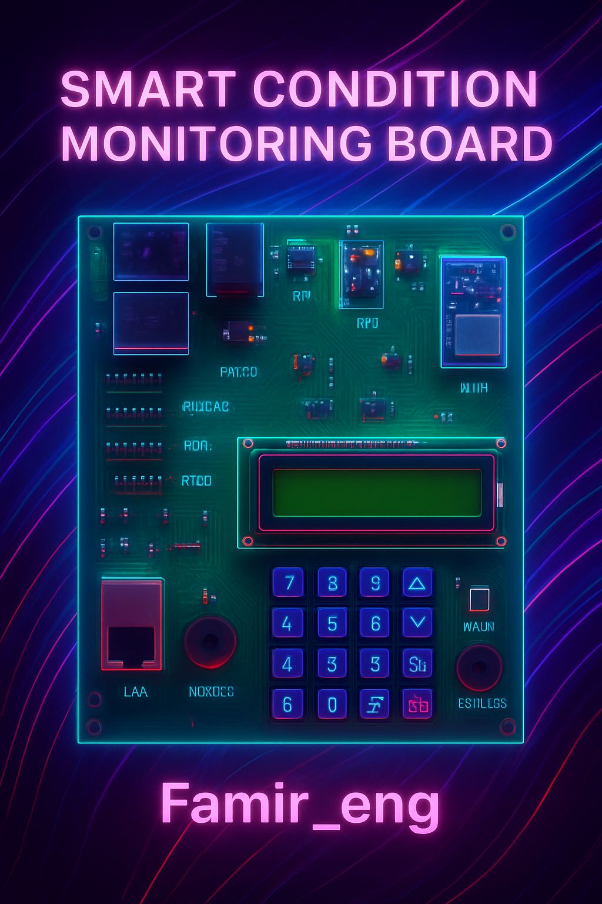
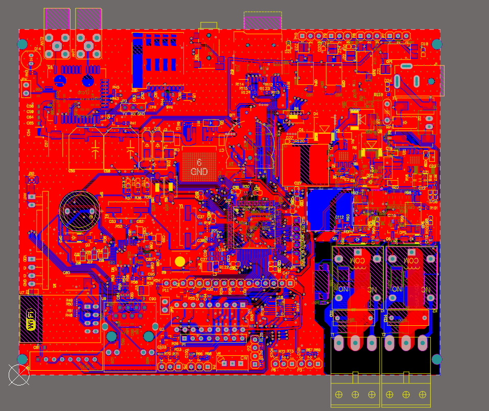
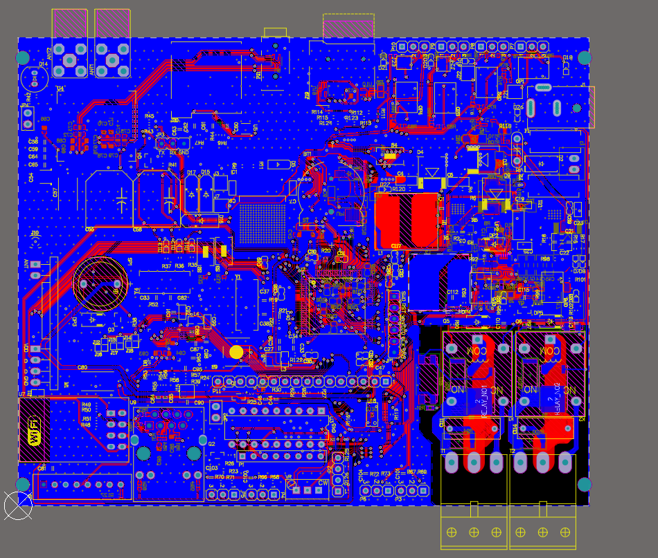
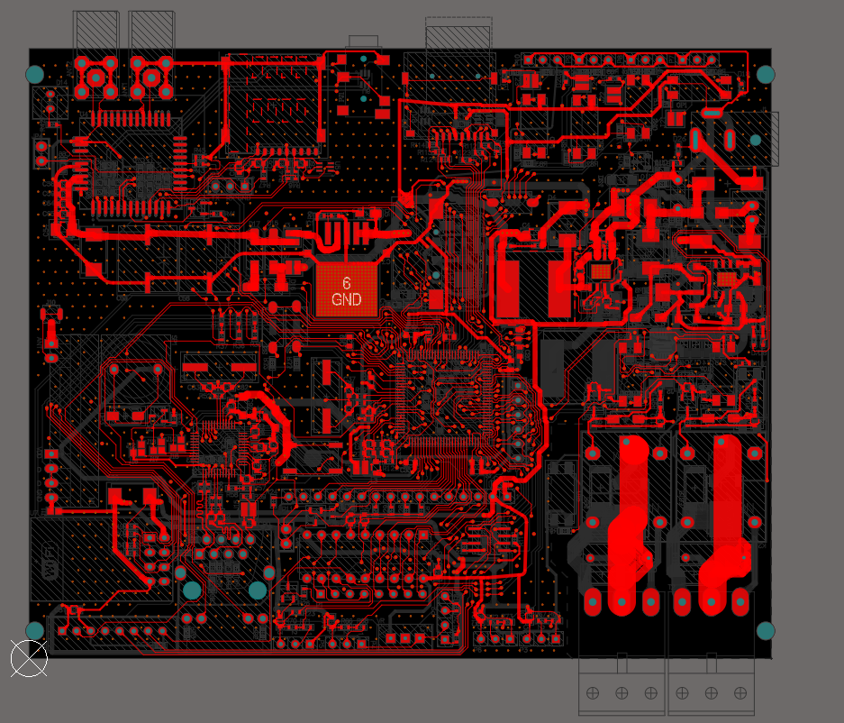
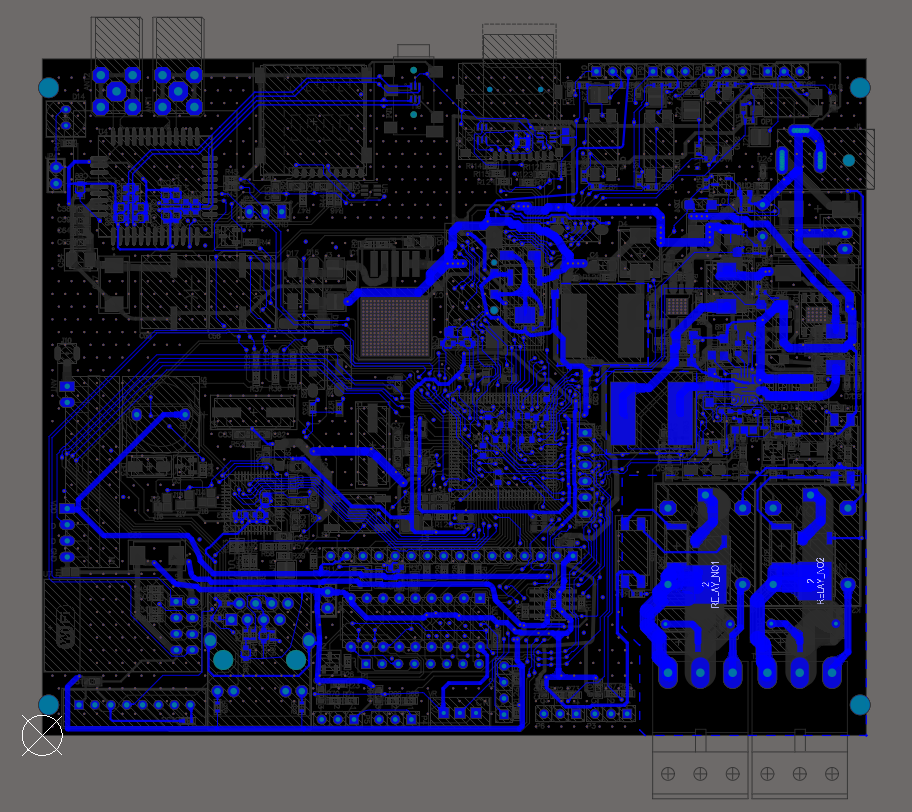
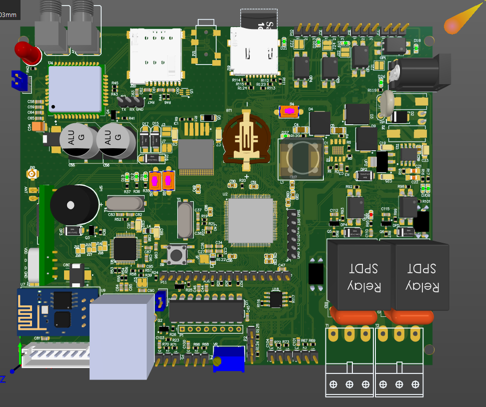

# 🌍 SMART Conditional Monitoring (SCM)

<p align="center">
  
</p>

---

The **SMART Conditional Monitoring (SCM)** project is an advanced system for **environmental condition monitoring**.  
It is built on the **STM32F103VTC6 microcontroller** and provides versatile options for **sensor connectivity and device control**.  

---
## ✨ Key Features

- 📡 **Multiple Communication Interfaces**  
  - Digital & Analog sensors  
  - I2C support  
  - **LAN (W5500 Ethernet module)**  
  - **WiFi (ESP8266 module)**  
  - **GSM (Quectel M66 module with SIM card slot)**  
  - **Remote RF (RXB22 receiver module)**  
  - RFID connectivity  

- ⚡ **Output Control**  
  - Relay  
  - TRIAC  

- 🖥️ **User Interface**  
  - LCD  
  - Keypad  

- 🔒 **Noise Reduction Design**  
  - 2-layer PCB  
  - Special measures implemented for EMC/EMI reduction  

---

## 🖼️ Project Images

### 📌 PCB Layout




### 📌 3D_PCB


---

## ⚙️ Hardware Overview

- Microcontroller: **STM32F103VTC6**  
- Relay + TRIAC for output control  
- **W5500 LAN module**  
- **ESP8266 WiFi module**  
- **Quectel M66 GSM module** with SIM card slot  
- **RXB22 RF module**  
- Connectors for sensors and external modules  

---

## 🚀 Project Goals

- Real-time **environmental monitoring**  
- Seamless integration with **network and wireless modules**  
- A scalable platform for **IoT and AI-based systems**  

---
## 📱 Follow on Instagram

Stay updated with the project:  
[](https://www.instagram.com/Famir_eng/)

---
## 📂 Repository Structure

```plaintext
├── /SCM
│   ├── PCB1.PcbDoc
│   ├── MCU.SchDoc
│   ├── Power.SchDoc
│   ├── Power2.SchDoc
│   ├── GSM.SchDoc
│   ├── LAN.SchDoc
│   ├── RF&wireless.SchDoc
│   ├── Output.SchDoc
│   ├── sensor.SchDoc
│   ├── UI.Sch.SchDoc
│   ├── memmory.SchDoc
├── /images
│   ├── pcb.png
│   └── 3D_pcb.png
├── MICRO PIN.xlxs
├──SCM.xlxs
├──SCM.ioc
├──SCM_V1.0 PCBA top.pdf
├──SCM_V1.0 PCBA Bottom.pdf
└── README.md
